# patronload

Creates Alma-compliant XML patron profiles from information extracted from the Data Warehouse and transmits those files to an S3 bucket for ingest into Alma.

# Alma Processing Requirements

Maximum size for a zip file is 4 GB
Maximum limit of 50 XML files in one zip file
Maximum of 20 zip files for each import/synchronization

This app uploads 2 under 50MB zip files, each containing 1 XML file, so it is unlikely that the files produced will conflict with these requirements.

## Development

- To install with dev dependencies: `make install`
- To update dependencies: `make update`
- To run unit tests: `make test`
- To lint the repo: `make lint`
- To run the app: `pipenv run patronload --help`

The Data Warehouse runs on a older version of Oracle that necessitates the `thick` mode of `python-oracledb` which requires the Oracle Instant Client Library (this app was developed with version 21.9.0.0.0.).

### With Docker

Note: as of this writing, the Apple M1 Macs cannot run Oracle Instant Client, so Docker is the only option for development on those machines. 

From the project folder:

1. Run `make dependencies` with appropriate AWS credentials.

2. Run `make dist-dev` to build the container.

3. Run `docker run alma-patronload-dev:latest`.

### Without Docker

1. Download [Oracle Instant Client](https://www.oracle.com/database/technologies/instant-client/downloads.html) (`basiclite` is sufficient) and set the `ORACLE_LIB_DIR` env variable.
   
2. Run `pipenv run patronload`.

## Connecting to the Data Warehouse

The password for the Data Warehouse is updated each year. To verify that the updated password works, the app must be run as an ECS task in the `stage` environment because Cloudconnector is not enabled in `dev1`. The app can run a database connection test when called with the flag, `--database_connection_test` or `-t`.

1. Export stage credentials and set `ECR_NAME_STAGE` and `ECR_URL_STAGE` env variables.
2. Run `make dependencies` with appropriate AWS credentials.
3. Run `make database-connection-test-stage`.
4. View the logs from the ECS task run on CloudWatch. 
   * On CloudWatch, select the `alma-integrations-patronload-ecs-stage` log group.
   * Select the most recent log stream. 
   * Verify that the following log is included: 

     > Successfully connected to Oracle Database version: \<VERSION NUMBER\>

## Running AWS ECS Tasks

To properly test with a connection to the Data Warehouse, the app must be run as an ECS task in the `stage` environment.

1. Export stage credentials and set `ECR_NAME_STAGE` and `ECR_URL_STAGE` env variables.
2. Run `make dependencies` with appropriate AWS credentials.
3. To build and publish the container to stage, run `make dist-stage` and `make publish-stage`. 
4. From Terraform Cloud, select the `workloads-patronload-stage` workspace and copy the `aws_cli_run_task` command.
5. Run the command in your terminal and observe the results in AWS.

## Workflows

### Code Workflow

```mermaid
flowchart LR;
    Amarkdown["`**load config values**
    Create dictionary of config variables containing environment variables
    `"] --> Bmarkdown["`**configure_logging**
    Create logger, create email log stream, and configure sentry
    `"] --> Cmarkdown["`**create database connection**
    Connect to the Data Warehouse
    `"] --> Dmarkdown["`**delete zip files from S3 bucket**
    Delete pre-existing zip files that match a set prefix
    `"] --> Emarkdown["`**Create queries to retrieve staff records**
    `"] --> Fmarkdown["`**submit sql queries to Data Warehouse**`"] --> Gmarkdown["`**create XML string from records**
    `"] --> Hmarkdown["`**create Zip file of XML string**
    `"] --> Imarkdown["`**upload Zip file to S3**
    `"] --> Jmarkdown["`**send email of logstream**`"]
    

```

## Required ENV

- `DATA_WAREHOUSE_USER` = The user for the Data Warehouse database.
- `DATA_WAREHOUSE_PASSWORD` = The password for the Data Warehouse database.
- `DATA_WAREHOUSE_HOST` = The host for the Data Warehouse database.
- `DATA_WAREHOUSE_PORT` = The port for the Data Warehouse database.
- `DATA_WAREHOUSE_SID` = The system identifier for the Data Warehouse database instance.
- `SES_RECIPIENT_EMAIL` = The email address to send to, typically a Moira list.
- `SES_SEND_FROM_EMAIL` = The email address to send from.
- `S3_BUCKET_NAME` = The S3 bucket in which files are deposited.
- `S3_PREFIX` = The file path prefix for files deposited to the S3 bucket.
- `WORKSPACE` = Set to `dev` for local development, this will be set to `stage` and `prod` in those environments by Terraform.

## Optional ENV

- `LOG_LEVEL` = The log level for the `alma-patronload` application. Defaults to `INFO` if not set.
- `ORACLE_LIB_DIR` = The directory containing the Oracle Instant Client library. 
- `SENTRY_DSN` = If set to a valid Sentry DSN, enables Sentry exception monitoring. This is not needed for local development.
